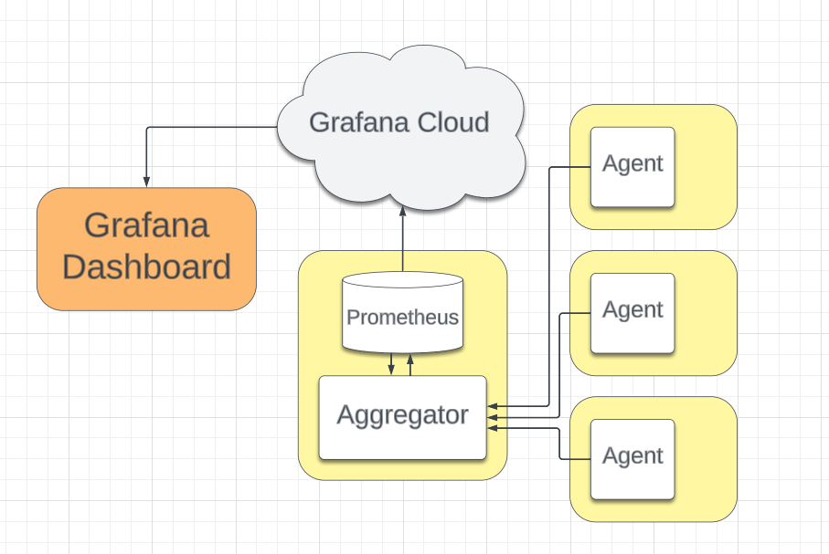

# Docker Data Exporter

Docker Data Exporter is a set of tools for collecting data on Docker containers and storing it in a Prometheus database. It can be installed on many servers at once, and collects data like engine info, container counts, and statuses of each container. The purpose of this project is to be able to use a Grafana Dashboard to monitor server and container statistics.

Here is a snapshot of an example Grafana Dashboard that was created using this project as well as the default Grafana Cloud Linux Server datasource:
https://jaydenp.grafana.net/dashboard/snapshot/S6ezcCcbcjVczckuZOTCTqtnRURUo9TK?orgId=1&from=1690308916851&to=1690319716851

## Architecture:

*(This diagram depicts our approach using a Grafana Cloud instance, as opposed to a self-hosted instance, where the architechture may look different)*

### Agent:

The agent is installed on any server that you wish to track Docker data on. It is where all the data originates from, and it returns the data upon request. It has an endpoint that returns a singular JSON object when the aggregator periodically scrapes. It also receives commands from the aggregator and executes them on the appropriate containers. Learn more about the agent, it's functionality and how to install it at the [agent README.md](./agent/README.md).

### Aggregator:

The aggregator is the middle man between Prometheus and the individual agents. Prometheus will periodically query the aggregator, then the aggregator scrapes its known list of IP addresses, and collects all the data and gives it to Prometheus.  
The purpose of the aggregator is to manage the agents, so Prometheus only has to scrape one target. If a server is offline, the aggregator can handle it so that Prometheus isn't stuck with empty values, and the user can know that it is down. But beware, the aggregator is a single point of failure, meaning that if it goes down, no data from any server will reach Prometheus. The aggregator also receives commands from the control panel and forwards them to the appropiate servers to execute. Learn more about the aggregator and how to install it at the [aggregator README.md](./aggregator/README.md).

 

## Collected Metrics:

There are two types of data collected, server data and container data. Note that the Prometheus format requires that all values are numbers, so string data is stored in the labels of the metric. The 'server_online' metric is the only one that is garenteed to work, as long as the IP is known and has responded before. 

| Metric: | Labels*: | Value: | Notes: |
| :- | :- | -: | :- |
| server_online | | 1 or 0 | Only works if agent has responded before and is known
| server_ip | server_ip="IP" | 1 | |
| server_hostname | server_hostname="HOSTNAME" | 1 | |
| server_agent_running | | 1 | |
| server_docker_running | | 1 or 0 | |
| server_docker_version | server_docker_version="VERSION" | 1 | |
| server_swarm_mode | | 1 or 0 | See [Docker swarm mode overview](https://docs.docker.com/engine/swarm/) |
| server_image_count | | ≥ 0 |
| server_total_container_count | | ≥ 0 | |
| server_running_container_count | | ≥ 0 | |
| container_info | container_id="ID", container_name="NAME", container_image="IMAGE", container_image_label="VERSION", container_user="USER", container_creation_time="ISO_TIME"| 1 | |
| container_state | container_state="STATE" | 1 | State can be 'created', 'restarting', 'running', 'removing', 'paused', 'exited', or 'dead' |
| container_status | container_status="STATUS" | 1 | Status includes info about state and uptime, e.g. "Up 30 minutes"
| container_cpu_percent | | 100 - 0 | |
| container_mem_percent | | 100 - 0 | |
| container_network_bytes_in | | ≥ 0 | |
| container_network_bytes_out | | ≥ 0 | |
| container_block_bytes_in | | ≥ 0 | |
| container_block_bytes_out | | ≥ 0 | |

_*Every metric includes the label server_hostname="HOSTNAME" and a duplicate label instance="HOSTNAME" (made for ease of use in grafana). Container metrics also include container_name="NAME"_
